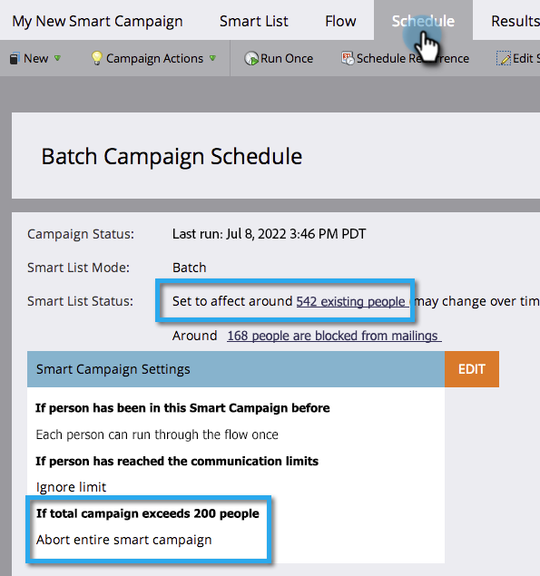

# 智能营销活动核对清单 {#smart-campaign-checklist}

请按照以下步骤操作，以确保顺利运行Smart Campaign，并尽可能防止出现错误。

## 删除智能列表错误 {#get-rid-of-smart-list-errors}

在Smart Campaign中，单击&#x200B;**[!UICONTROL 智能列表]**。 通过修复错误来消除您看到的任何红色弯曲线。

>[!TIP]
>
>红色曲线表示错误或缺少信息。 如果未更正，则营销活动将无效且不会运行。
>
>另外，保持简单。 如果您拥有数十个或数百个过滤器，则很难对其进行维护和跟踪。 数量更少的过滤器也更快加载。

>[!NOTE]
>
>使用&#x200B;**[!UICONTROL 智能列表的成员]**&#x200B;可能会在其他列表中出现错误。 也请检查。

## 删除流错误 {#get-rid-of-flow-errors}

在Smart Campaign中，单击&#x200B;**[!UICONTROL 流量]**。 通过修复错误来消除您看到的任何红色弯曲线。

>[!TIP]
>
>将鼠标悬停在红色弯折线上，以查看错误的详细信息。

## 查看“计划”选项卡 {#review-the-schedule-tab}

在&#x200B;**[!UICONTROL 计划]**&#x200B;选项卡中，检查&#x200B;**[!UICONTROL 智能列表状态]**&#x200B;以了解智能营销活动中需要修复的任何错误。

## 检查人员限制限制 {#check-person-restrictions-limit}

在&#x200B;**[!UICONTROL 计划]**&#x200B;选项卡中，确保合格人员的数量不超过人员限制限制。

>[!TIP]
>
>如果需要，您可以[在Smart Campaign](/help/marketo/product-docs/core-marketo-concepts/smart-campaigns/using-smart-campaigns/override-person-restrictions-in-a-smart-campaign.md)中覆盖人员限制。

>[!NOTE]
>
>**提醒**
>
>如果Smart Campaign仍然失败，请了解如何[了解通知](/help/marketo/product-docs/core-marketo-concepts/miscellaneous/understanding-notifications.md)以确定哪里出错误以及如何修复错误。

做得好！在运行Smart Campaign之前，请准备好此核对清单。
