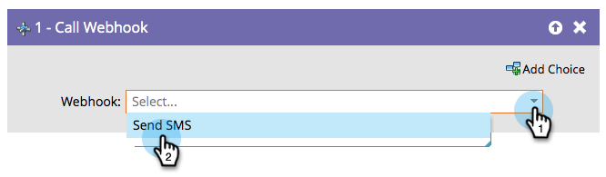

# 调用 Webhook {#call-webhook}

>[!PREREQUISITES]
>
>[创建Webhook](/help/marketo/product-docs/administration/additional-integrations/create-a-webhook.md){target="_blank"}

Webhook允许您与第三方服务进行交互。 通过在智能营销活动流中调用webhook来发送/接收信息。

>[!NOTE]
>
>了解[Webhooks](https://experienceleague.adobe.com/zh-hans/docs/marketo-developer/marketo/webhooks/webhooks){target="_blank"}可以为您做许多有趣的事情。

1. 从下拉列表中选择Webhook。

仅此而已！ 现在，每当用户输入智能营销活动流时，都会调用您的webhook。

>[!MORELIKETHIS]
>
>[在智能营销活动中使用Webhook](/help/marketo/product-docs/core-marketo-concepts/smart-campaigns/flow-actions/use-a-webhook-in-a-smart-campaign.md){target="_blank"}
