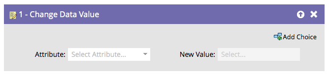

# 更改数据值 {#change-data-value}

您可以使用Marketo更新字段的值。 为此，您将使用&#x200B;**[!UICONTROL Change Data Value]**&#x200B;流程操作。

>[!NOTE]
>
>您还可以阻止字段更新。 有关详细信息，请参阅[阻止更新字段](/help/marketo/product-docs/administration/field-management/block-updates-to-a-field.md){target="_blank"}。

1. 查找并选择要更改其值的字段。

   

1. 输入所需的值。

   

   >[!NOTE]
   >
   >您还可以在&#x200B;**[!UICONTROL New Value]**&#x200B;中使用令牌。

   >[!TIP]
   >
   >您可以在&#x200B;**[!UICONTROL New Value]**&#x200B;中输入“NULL”（无引号，全部大写）以清除该字段。 有关详细信息，请参阅[清除字段值](/help/marketo/product-docs/core-marketo-concepts/smart-campaigns/flow-actions/clear-field-values.md){target="_blank"}。

   >[!NOTE]
   >
   >* 流步骤的[令牌](/help/marketo/product-docs/core-marketo-concepts/smart-campaigns/flow-actions/use-tokens-in-flow-steps.md){target="_blank"}
   >* [将数据附加到字段](/help/marketo/product-docs/core-marketo-concepts/smart-campaigns/flow-actions/append-data-to-a-field.md){target="_blank"}
