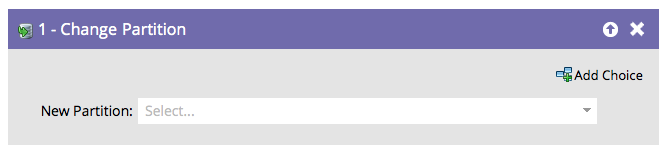

# 更改人员分区 {#change-person-partition}

如果您使用的是[工作区和分区](/help/marketo/product-docs/administration/workspaces-and-person-partitions/understanding-workspaces-and-person-partitions.md){target="_blank"}，您将需要构建智能营销活动以将人员从一个分区移动到另一个分区。

1. 选择要将人员移动到的分区。

