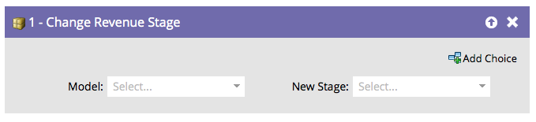

# 更改收入阶段{#change-revenue-stage}

## 概述{#overview}

如果您使用收入周期建模器并拥有已批准的模型，则可以决定手动将潜在客户从一个阶段移动到另一个阶段。 此流程步骤将有所帮助。

## 用法{#usage}

1. 选择&#x200B;**Model**。

   

1. 选择要分配的&#x200B;**新建阶段**，您就完成了！

   

   >[!CAUTION]
   >
   >data warehouse会密切关注潜在客户在不同阶段之间移动的时间。 如果使用不正确，可能会创建错误数据。
