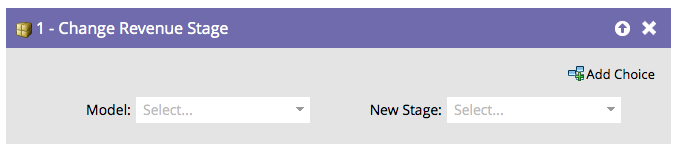
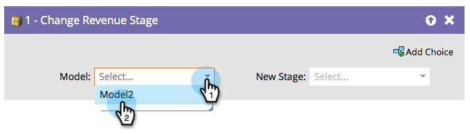

# 更改收入阶段 {#change-revenue-stage}

如果您使用Revenue Cycle Modeler并且拥有已批准的模型，则可以决定手动将人员从一个阶段移动到另一个阶段。 此流程步骤将有所帮助。

1. 选择 **[!UICONTROL Model]**。

   

1. 选择要分配的&#x200B;**[!UICONTROL New Stage]**，操作已完成！

   

   >[!CAUTION]
   >
   >数据仓库中会密切关注人们在不同阶段之间的移动情况。 如果使用不正确，这可能会产生错误数据。
