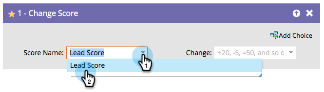

# 更改得分 {#change-score}

对人员打分既简单又强大，有助于您的销售团队确定优先级。

1. 选取要更改的分数字段。

   

   >[!TIP]
   >
   >您可以创建多个得分字段。 有关详细信息，请参阅[在Marketo中创建自定义字段](/help/marketo/product-docs/administration/field-management/create-a-custom-field-in-marketo.md){target="_blank"}。

1. 输入您需要的分数更改。

   

   更改：

   * **+5**&#x200B;递增
   * **-5**&#x200B;将递减（允许负数）
   * **=5**&#x200B;将使分数等于该数字
   * **=-5**&#x200B;将使得分成为完全负数

快速获得一些基本分数，然后随着时间的推移调整结果。
