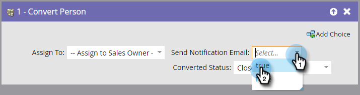
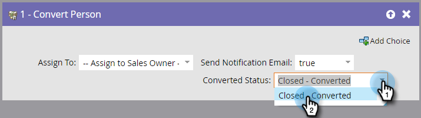

# 转换人员 {#convert-person}

使用此流程步骤在[!DNL Salesforce]中将人员转换为联系人。 您可以决定要将联系人分配给谁，向责任人发送通知，以及设置已转换状态。

>[!NOTE]
>
>这仅在与[!DNL Salesforce]集成时可用。

1. 选择要将生成的联系人、客户和机会分配给谁。

   

   >[!CAUTION]
   >
   >在Marketo中转化人员将在[!DNL Salesforce]中产生新帐户和机会。 如果不希望帐户重复，请使用[!DNL Salesforce]进行转换。

1. 选择您是否希望将&#x200B;**[!UICONTROL notification]**&#x200B;发送给所有者。

   

1. 选择 **[!UICONTROL converted status]**。

   
