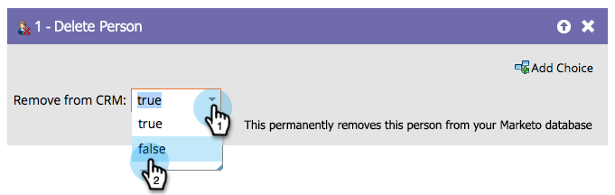

# 删除人员 {#delete-person}

错误的人有时会进入您的数据库。 可以使用“删除人员”流程步骤删除这些人员。

>[!CAUTION]
>
>在删除人员时，也将删除其所有历史RCE数据。 无法撤消此操作。

1. 当您在流程步骤中拖动时，它也会自动设置为从您的CRM中删除。

   

1. 您可以从Marketo Engage中删除，但不能从CRM中删除，如下所示：

   

>[!NOTE]
>
>从CRM _中删除此人仅适用于[!DNL Salesforce]_。 如果您从Marketo中删除人员并选择将他们保留在[!DNL Salesforce]中，则当他们的[!DNL Salesforce]记录更新时，将在Marketo中重新创建他们。
