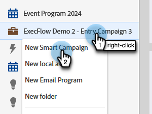

# 执行Campaign {#execute-campaign}

与其他营销活动一样，可执行营销活动包含智能列表、流量和计划。 与其他营销活动不同，您实际上不会计划或激活它。 只能由其他营销活动通过执行营销活动流程步骤调用。 可执行营销活动中的流程步骤与父营销活动一起串联运行（与请求营销活动不同，请求营销活动在单独的触发器营销活动中并行运行）。

>[!NOTE]
>
>可执行营销活动始终是调用它们的（父）营销活动的子项。

## 何时执行营销活动 {#when-to-use-execute-campaign}

您可以使用可执行营销活动执行许多操作。 它们旨在促进常见的操作任务，如商机路由、生命周期管理和评分（等等），并可用于在批处理或触发式营销活动中执行相同的工作流。

在需要运行单独的流时，您也可以使用它们，但在后续的流步骤选择中，您需要依赖该流的结果（即，如果是这样，则需要这样做）。

执行营销活动是 [请求营销活动](/help/marketo/product-docs/core-marketo-concepts/smart-campaigns/flow-actions/request-campaign.md)，因为它可以串联或并行运行，而后者只能并行运行。

>[!NOTE]
>
>等待步骤和Webhook将永远不能与可执行促销活动兼容。 对于这些，您将需要使用请求营销活动。

## 如何创建可执行的营销活动 {#how-to-create-an-executable-campaign}

1. 右键单击所需的程序并选择 **新的智能营销活动**.

   

1. 为其命名，选择 **可执行文件** 复选框，然后单击 **创建**.

   

1. 与任何其他智能营销活动一样，定义智能列表和流量。

您还可以克隆现有的智能营销活动。 如果您克隆了现有的可执行营销活动，则仍必须选择 **可执行文件** 复选框。

>[!NOTE]
>
>无法克隆包含触发器的营销活动。

## 使用父营销活动令牌上下文 {#use-parent-campaign-token-context}

当设置为true时，将以下令牌上下文将发送到子营销活动（正在执行的令牌上下文）：

* 我的令牌
* 促销活动令牌
* 程序令牌
* 成员令牌
* [触发器令牌](/help/marketo/product-docs/marketo-sales-insight/msi-for-salesforce/features/tabs-in-the-msi-panel/interesting-moments/trigger-tokens-for-interesting-moments.md) （如果从触发式营销活动中调用）

**API交互**

使用计划或请求营销活动时 [在API中](https://developers.marketo.com/rest-api/assets/smart-campaigns/#batch)，都允许您传递我的令牌值，这将覆盖您在营销活动中为这些令牌设置的值。 如果该营销活动随后执行另一个营销活动并将“使用父上下文”设置为True，则将使用通过API传递的值，而不是应用程序中设置的值。

## 注意事项 {#things-to-note}

* 智能列表会过滤出不符合条件的任何人。 如果某人符合条件，则生成的已执行促销活动活动记录会将其列为“符合条件：TRUE”（如果没有，则为FALSE）
* 计划营销活动资格规则（“计划”选项卡下的“智能营销活动设置”）
* 无法跨工作区调用可执行文件营销活动
* 如果您使用 [从流中删除](/help/marketo/product-docs/core-marketo-concepts/smart-campaigns/flow-actions/remove-from-flow.md) 针对可执行营销活动的流程操作，它将同时针对子营销活动和父营销活动
* 利用令牌继承 — 例如，如果您有一个由多个不同资产触发的通用评分流程，则可以在子营销活动和父营销活动中定义默认的“我的令牌”得分，以便覆盖父营销活动的子得分营销活动值（请参阅下文，以查看视图示例）
* 可执行营销活动可调用多达三个级别（例如，父营销活动>子项>子项>子项）

>[!CAUTION]
>
>请勿将可执行促销活动的智能列表保留为无效状态，否则 **没有人** 才有资格参加。 最佳做法是创建单独的智能列表资产，完整定义这些资产，并确保它们有效。 然后，在可执行促销活动中使用“智能列表成员”过滤器，以便您可以交换智能列表定义。

## 令牌继承示例 {#token-inheritance-example}

下面是一个可执行促销活动和两个父促销活动中令牌继承的可视示例：将令牌上下文设置为 **True**，另一个 **False**.

具有标记化更改分数的子营销活动。

子营销活动的“我的令牌”。

**示例1 - True**

在第一个父营销活动的“执行营销活动”流程步骤中，“使用父营销活动令牌上下文”设置为 **True**.

父营销活动的“我的令牌”。

结果：分数改为+10。

**示例二：False**

在第二个父营销活动的“执行营销活动”过滤器中，“使用父营销活动令牌上下文”设置为 **False**.

父营销活动的“我的令牌”。

结果：得分未更改，因为使用了子营销活动的得分值+0。

