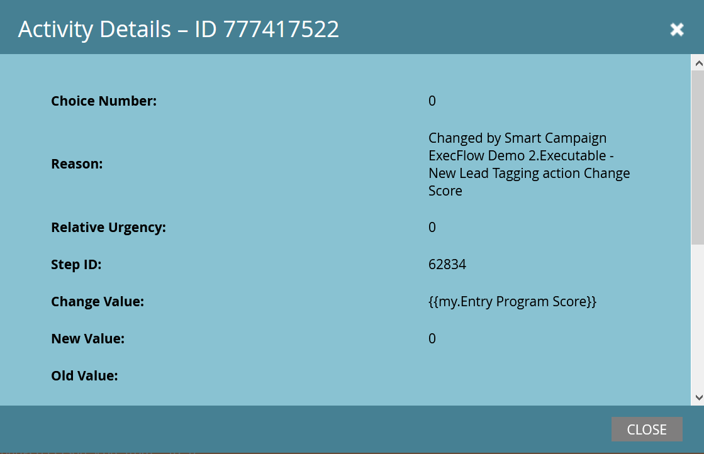

# 执行营销活动 {#execute-campaign}

与其他营销活动一样，可执行营销活动包含智能列表、流量和计划。 与其他营销活动不同，您实际上并不计划或激活它。 它只能由其他营销活动通过执行营销活动流程步骤调用。 可执行营销活动中的流程步骤与父营销活动串联运行（与请求营销活动不同，请求营销活动在单独的触发器营销活动中并行运行）。

>[!NOTE]
>
>可执行的营销活动始终是调用它们的（父）营销活动的子项。

## 何时使用执行营销活动 {#when-to-use-execute-campaign}

使用可执行活动，您可以执行许多操作。 它们旨在促进常见的操作任务，如商机路由、生命周期管理和评分（等等），并可用于从批量活动或触发的活动中执行相同的工作流。

当您需要运行单独的流时，也可以使用它们，但您需要在后续的流步骤选择中依赖该流的结果（即，如果这样做，则这样做）。

执行Campaign是对以下方面的改进 [请求营销活动](/help/marketo/product-docs/core-marketo-concepts/smart-campaigns/flow-actions/request-campaign.md)，因为它可以串联运行，而后者只能并行运行。

>[!NOTE]
>
>等待步骤和Webhook绝不会与可执行营销活动兼容。 为此，您需要改用Request Campaign。

## 如何创建可执行活动 {#how-to-create-an-executable-campaign}

1. 右键单击所需的项目并选择 **新建智能营销活动**.

   

1. 为其命名，选择 **可执行文件** 复选框，然后单击 **创建**.

   

1. 与任何其他智能营销活动一样，定义智能列表和流量。

您还可以克隆现有的Smart Campaign。 如果克隆现有的可执行活动，则仍必须选择 **可执行文件** 复选框。

>[!NOTE]
>
>无法克隆包含触发器的营销活动。

## 使用父营销活动令牌上下文 {#use-parent-campaign-token-context}

当设置为true时，以下令牌上下文将发送到子营销活动（正在执行的营销活动）中：

* 我的令牌
* 营销活动令牌
* 项目令牌
* 成员令牌
* [触发器令牌](/help/marketo/product-docs/marketo-sales-insight/msi-for-salesforce/features/tabs-in-the-msi-panel/interesting-moments/trigger-tokens-for-interesting-moments.md) （如果从触发的活动中调用）

**API交互**

使用计划或请求营销活动时 [在API中](https://developers.marketo.com/rest-api/assets/smart-campaigns/#batch)，则这两者均允许您传递“我的令牌”的值，这将会覆盖在要调用的营销活动中为这些令牌设置的值。 如果该营销活动随后执行另一个营销活动并设置“使用父上下文设置为True”，则它将使用通过API传递的值，而不是在应用程序中设置的值。

## 注意事项 {#things-to-note}

* 智能列表将筛选出不符合条件的任何人。 如果人员符合条件，则生成的已执行营销活动记录会将其列为“符合条件：TRUE”（如果不符合，则列为FALSE）
* 应用计划Campaign资格规则（“计划”选项卡下的“Smart Campaign设置”）
* 无法跨工作区调用可执行营销活动
* 如果您使用 [从流中删除](/help/marketo/product-docs/core-marketo-concepts/smart-campaigns/flow-actions/remove-from-flow.md) 流操作针对可执行活动，它会同时针对子活动和父活动
* 利用令牌继承 — 例如，如果您有一个由多个不同资产触发的通用评分流，则可以在子营销活动和父营销活动中定义默认的“我的令牌”分数，以便您可以覆盖父营销活动的子分数营销活动值（请参阅下面的可视示例）
* 可执行的营销活动最多可以调用三个级别（例如，父营销活动>子营销活动>子营销活动>子营销活动）

>[!CAUTION]
>
>切勿使可执行营销活动的智能列表无效，否则 **无人** 将符合条件。 最佳实践是创建单独的智能列表资产，完整定义这些资产并确保其有效。 然后，使用可执行活动中的“智能列表的成员”过滤器，以便交换智能列表定义。

## 令牌继承示例 {#token-inheritance-example}

下面是一个可执行营销活动和两个父营销活动中令牌继承的可视示例：一个将令牌上下文设置为 **True**，其他到 **假**.

具有标记化更改分数的子营销活动。

儿童营销活动的我的令牌。

**示例1 - True**

在第一个父营销活动的“执行营销活动”流程步骤中，“使用父营销活动令牌上下文”设置为 **True**.

父营销活动的“我的令牌”。

结果：分数变化了+10。

**示例2：False**

在第二个父营销活动的“执行营销活动”过滤器中，“使用父营销活动令牌上下文”设置为 **假**.

父营销活动的“我的令牌”。

结果：得分未更改，因为使用了子营销活动的得分值+0。

