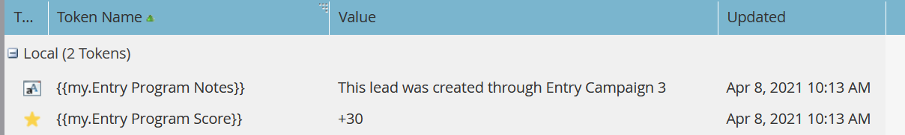

# 执行活动{#execute-campaign}

可执行活动与其他活动一样，包含智能列表、流和计划。 与其他活动不同，您实际上不会计划或激活它。 它只能由其他活动通过执行活动流步骤调用。 “可执行活动”中的流步骤与父活动串联运行(与“请求活动”不同，“请求活动”在单独的“触发器”中并行运行)。

>[!NOTE]
>
>可执行活动始终是调用它们的（父级）活动的子级。

## 何时使用执行活动{#when-to-use-execute-campaign}

您可以使用可执行活动执行许多操作。 它们旨在促进常见的操作任务，如潜在客户路由、生命周期管理和评分（等等），并可用于在批处理或触发活动中执行相同的工作流。

在需要运行单独的流时，您也可以使用它们，但在后续流步骤选择中，您需要依赖该流的结果（即，如果这样做）。

执行活动是对[请求活动](/help/marketo/product-docs/core-marketo-concepts/smart-campaigns/flow-actions/request-campaign.md)的改进，因为它可以串联或并行运行，而后者只并行运行。

>[!NOTE]
>
>等待步骤和Webhooks将永远不与可执行活动兼容。 对于这些，您需要改用“请求活动”。

## 如何创建可执行活动{#how-to-create-an-executable-campaign}

1. 右键单击所需项目，然后选择&#x200B;**新建智能活动**。

   

1. 给它取一个名称，选中&#x200B;**可执行**&#x200B;复选框，然后单击&#x200B;**创建**。

   

1. 像定义任何其他智能列表一样定义智能活动和流。

您还可以仿制现有的智能活动。 如果克隆现有的可执行活动，则在命名后仍必须选中&#x200B;**可执行**&#x200B;复选框。

>[!NOTE]
>
>无法克隆包含触发器的活动。

## 使用父活动令牌上下文{#use-parent-campaign-token-context}

设置为true时，将以下令牌上下文将发送到子活动（正在执行的令牌）：

* 我的令牌
* 活动令牌
* 项目令牌
* 成员令牌
* [触发令牌](/help/marketo/product-docs/marketo-sales-insight/msi-for-salesforce/features/tabs-in-the-msi-panel/interesting-moments/trigger-tokens-for-interesting-moments.md) (如果从触发活动调用)

**API交互**

在API](https://developers.marketo.com/rest-api/assets/smart-campaigns/#batch)中使用计划或请求活动[时，两者都允许您传递“我的令牌”值，这将覆盖您所调用活动中为这些令牌设置的值。 如果该活动随后执行另一个活动并将“使用父上下文”设置为“真”，则它将使用通过API传递的值，而不是应用程序中设置的值。

## 注意事项{#things-to-note}

* 智能列表将过滤不符合条件的任何人。 如果某人符合条件，则生成的已执行活动活动记录将列表为“合格：TRUE”（如果不是，则为FALSE）
* 计划活动资格规则适用(“计划”选项卡下的智能活动设置)
* 无法跨工作区调用可执行活动
* 如果您使用[从流](/help/marketo/product-docs/core-marketo-concepts/smart-campaigns/flow-actions/remove-from-flow.md)中删除以可执行活动为目标的流动操作，它将同时目标子项和父项
* 充分利用令牌继承 — 例如，如果您有一个由多个不同资产触发的通用评分流，则可以在子活动和父活动中定义默认的我的令牌得分，以便您可以覆盖父活动的子分数活动值（例如，可视示例请参阅下面）
* 嵌套可执行活动目前不可用，但将在即将发布的版本中提供

>[!CAUTION]
>
>请勿将可执行活动的智能列表保留为无效，否则&#x200B;**没有人符合此要求。**&#x200B;最佳实践是创建单独的智能列表资源，完全定义这些资源，并确保这些资源有效。 然后，在“可执行活动”中使用“智能列表成员”过滤器，以便您可以交换智能列表定义。

## 令牌继承示例{#token-inheritance-example}

以下是一个可执行活动和两个父活动中的令牌继承的可视示例：一个将令牌上下文设置为&#x200B;**True**，另一个设置为&#x200B;**False**。

具有标记的更改分数的子活动。

孩子的活动我的令牌。

**示例1 - True**

在第一个父活动的执行活动流步骤中，“使用父活动令牌上下文”设置为&#x200B;**True**。

父活动的“我的令牌”。

结果：分数改为+10。

**示例二：False**

在第二个父活动的“执行活动”过滤器中，“使用父活动令牌上下文”设置为&#x200B;**False**。

父活动的“我的令牌”。

结果：分数保持不变，因为使用了子活动的得分值+0。

