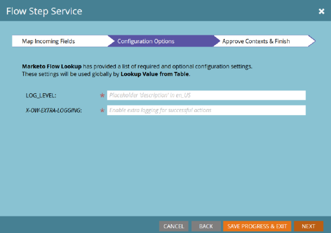

# 流步骤服务 {#flow-step-service}

>[!NOTE]
>
>此预发行功能目前仅适用于已注册参加自助服务流程步骤测试版计划的帐户。

自助服务流程步骤是一个框架和一组功能，用于创作、发布Web服务并将其集成到AdobeMarketo Engage智能营销活动中。 本指南面向那些想要安装和使用已创建和发布的服务的最终用户。 有关创作和发布您自己的服务的信息，请参阅 [服务提供商界面的GitHub存储库](https://github.com/adobe/Marketo-SSFS-Service-Provider-Interface). 可以找到概念验证对照表实现 [此处](https://github.com/adobe/mkto-flow-lookup).

## 预发行限制和警告 {#pre-release-restrictions-and-warnings}

此功能当前为封闭测试版，且对使用存在一些限制。

* 此功能只能用于Marketo Engage的沙盒实例
* 自2021年第4季度发行以来，自定义和第三方流程步骤与可执行促销活动不兼容。 计划在2022年第2季度修复此问题
* Marketo SkyUI不应在启用此功能的实例上使用

## 入门和管理服务 {#onboarding-and-managing-services}

安装自定义流程步骤需要在Marketo中具有管理员权限(**管理Webhooks** 在1月21日版本中，在3月11日版本中进行更改)。 除了安装URL之外，在完成初始载入后，可以通过从服务提供商网格向下浏览服务详细信息屏幕来编辑服务的所有其他方面。

## 安装URL {#installation-url}

要开始安装，您首先需要获取定义服务的OpenAPI文档的URL。 您的服务提供商应能够为您提供此功能，并且通常的URL将以 `/openapi.json`. 完整的URL将类似于 `https://www.example.com/OpenAPI.json`. 获得此URL后，转到“管理员”部分的“服务提供商”菜单。

单击 **下一个** 转到输入服务凭据部分。

## 输入服务凭据 {#enter-service-credentials}

要访问正在安装的服务，Marketo必须具有有效的API凭据。 您的服务提供商应向您提供这些凭据。 服务具有三个不同的身份验证选项，因此您可能会看到凭据的三个不同提示之一： **API密钥** 只有一个输入字段， **基本身份验证** 需要用户名和密码，并且可能还需要名为“领域”的字段，以及 **OAuth2** 使用 _客户端凭据_ 格兰特，这要求 _客户端ID_ 和 _客户端密钥_.

>[!NOTE]
>
>OAuth2在3月11日版本之前才可用。

保存凭据时，Marketo将尝试调用服务的状态端点以验证凭据是否有效。 如果提供的凭据无效，您将看到指示此内容的错误。

## 入门指南（可选） {#onboarding-guide}

某些服务提供商将包含一个可选的入门指南步骤。 此步骤将包含有关完成特定于该服务的服务载入的任何其他说明。

## 字段映射 {#field-mapping}

要接收或返回特定潜在客户字段的数据，必须映射该字段。 虽然在载入期间需要执行映射步骤，但您可能始终会返回以后更改映射。 在不同的屏幕中配置了两种类型的映射： **传出字段**，在Marketo调用流步骤时发送到服务，以及 **传入字段** 即在将数据返回到Marketo时可从服务接收数据的字段。

>[!NOTE]
>
>通过映射传出字段，您将授予Marketo权限，以便从与关联服务处理的潜在客户相关的字段中传输数据。 确保您拥有适当的法律地位和权限，可以将此数据传输到您的服务提供商，因为这些字段可能包括数据隐私、保护和租赁法涵盖的个人身份信息。

可选字段映射在不中断您的服务的情况下被禁用，但必需映射可能无法完全删除或停用。

## 服务驱动映射 {#service-driven-mappings}

具有一组固定输入和输出的服务（如事件注册流程步骤）使用 **服务驱动映射**. 对于此类映射，服务提供商将提供API名称形式的数据类型和提示。 如果提示与现有潜在客户字段的API名称匹配，则该字段将自动填充到映射部分中。 对于没有匹配提示的字段，您需要从具有匹配数据类型的字段列表中手动填充映射。 必须填充所需的映射才能完成载入。

## 用户驱动映射 {#user-driven-mappings}

没有固定输入和输出集的服务（如日期格式服务）使用 **用户驱动映射**. 这意味着每个传入和传出字段都必须由管理员配置。

## 传出字段 {#outgoing-fields}

传出字段是在智能营销活动中使用流量步骤时发送到流量步骤服务的字段。

## 传入字段 {#incoming-fields}

传入字段是允许流程步骤服务将数据写入的字段。

## 配置选项（可选） {#configuration-options}

某些服务具有可选或必需的全局配置选项。 如果需要任何选项，则必须为所有必需选项设置值，然后才能保存或完成载入。 名称为斜体的参数将作为标头发送到被调用的服务。

## 停用服务 {#retiring-a-service}

为了促进服务的新版本或替代版本的过渡，而不会中断服务的活动使用，可以从“服务提供商”菜单中停用服务。 **停用服务** 从智能促销活动流量板中删除相应的流量步骤，以便不能创建其新用法。 在大多数情况下，您应该准备好替换服务，以在您选择停用服务时替换现有服务。

## 服务弃用 {#service-deprecation}

有时，服务提供商需要弃用作为软件生命周期正常部分的流程步骤服务。 当服务提供商宣布此消息时，弃用日期和消息将填充在“服务提供商”网格视图中。 如果继续使用已弃用的服务不再以预期方式响应，或停止接受来自Marketo智能营销活动的请求，则可能会导致服务中断，因此您应当密切关注收到的任何服务弃用通知，并采取适当步骤停用或替换仍在使用的服务中的任何步骤。

## 使用第三方和自定义流程步骤 {#using-third-party-and-custom-flow-steps}

安装的流程步骤的使用方式与标准流程步骤大致相同。 服务定义的所有流参数都将呈现给最终用户。

## 刷新选取器 {#refreshing-picklists}

Marketo将每晚刷新服务的选择列表选项，但有时您需要新选项，如创建营销活动。 在选择服务后，您可以使用刷新按钮从流程步骤的任何实例轻松刷新这些实例，或转到管理员>服务提供商菜单并单击刷新选取列表。

## 检查传入字段 {#checking-incoming-fields}

您可以将鼠标悬停在给定流程步骤的工具提示图标上，以检查为其配置的传入字段。 这有助于确定潜在客户在流过该字段时哪些字段可能会发生更改，因此您可以使用这些字段在后续步骤中配置选项。

## 传入字段和数据值更改 {#incoming-fields-and-data-value-changes}

与大多数其他流程步骤不同，通过SSFS框架实施的流程步骤可能会将数据写回由管理员映射的潜在客户字段，并将这些更改记录为数据值更改活动。  当流程步骤以这种方式写入数据时，所有这些更改都将在智能营销活动继续执行任何后续步骤之前完成，因此在后续流程步骤选择中可能会依赖写入的任何数据。

## 服务日志和统计信息 {#service-logs-and-statistics}

每个流程步骤服务都有多种与其关联的日志记录类型，可帮助监控运行状况并解决与集成相关的任何问题。

## 服务统计 {#service-statistics}

服务统计日志汇总每个服务的调用和回调结果。 它们按时间、级别（块或记录）和代码进行分组，并为每个收到的代码提供计数和最新的日志消息。 此仪表板主要用于协助监测服务状况。
