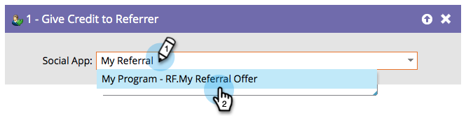

# 将点数提供给反向链接 {#give-credit-to-referrer}

运行&#x200B;_反向链接选件_&#x200B;或&#x200B;_抽奖_&#x200B;时，您可以使用不同的方法将点数提供给反向链接：

* 引见
* 引用的注册
* **智能列表触发器**
* 自定义JavaScript事件

如果您选择使用&#x200B;**智能列表触发器**&#x200B;选项指定目标，则需要使用&#x200B;**将点数提供给反向链接**&#x200B;流程步骤。

1. 构建活动并决定要触发什么操作后，只需查找并选择要将点数提供给反向链接的Social应用程序。

   

   >[!NOTE]
   >
   >确保将您的社交应用程序配置为使用智能列表触发器。 有关详细信息，请参阅&#x200B;_指定反向链接选件的目标_。

太棒了！ 现在，任何由此流程步骤处理的人员，都会将其点数提供给其反向链接。
