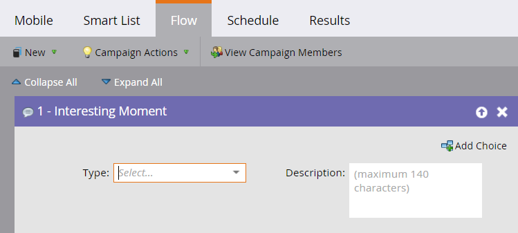
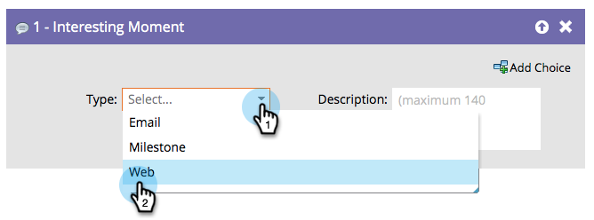

# 有趣的时刻{#interesting-moment}

## 概述{#overview}

如果您有Marketo Sales Insight，则可以使用&#x200B;**有趣的时刻**&#x200B;流步骤让您的销售团队了解您的员工正在做的事情。

## 用法{#usage}

1. 选择要使用的有趣时刻&#x200B;**类型**。

   

1. 创建&#x200B;**description**，以说明您的销售团队所感兴趣的时刻。

   

   >[!TIP]
   >
   >**少是多**。与您的销售团队合作，确保有趣的时刻真正有趣。

您还可以在有趣的时刻](/help/marketo/product-docs/marketo-sales-insight/msi-for-salesforce/features/tabs-in-the-msi-panel/interesting-moments/tokens-for-interesting-moments.md)使用[令牌来做出真正有用的动态描述。

>[!MORELIKETHIS]
>
>* [使用有趣的瞬间](/help/marketo/product-docs/marketo-sales-insight/msi-for-salesforce/features/tabs-in-the-msi-panel/interesting-moments/using-interesting-moments.md)
>* [有趣时刻的令牌](/help/marketo/product-docs/marketo-sales-insight/msi-for-salesforce/features/tabs-in-the-msi-panel/interesting-moments/tokens-for-interesting-moments.md)

