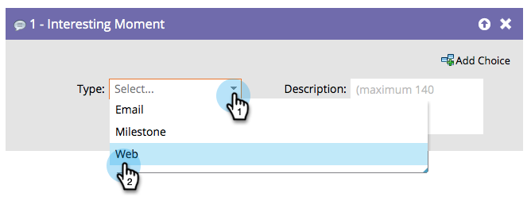

# 重要时刻 {#interesting-moment}

如果您拥有Marketo Sales Insight，则可以使用&#x200B;**有趣的时刻**&#x200B;流程步骤让您的销售团队了解您的人员正在做的那些有趣的事情。

1. 选择要使用的有趣时刻&#x200B;**[!UICONTROL type]**。

   

1. 创建一个&#x200B;**[!UICONTROL description]**，向您的销售团队解释这个有趣的时刻。

   

   >[!TIP]
   >
   >_更少_。 与您的销售团队合作，确认有趣的时刻实际上很有趣。

您还可以在有趣的时刻使用[令牌](/help/marketo/product-docs/marketo-sales-insight/msi-for-salesforce/features/tabs-in-the-msi-panel/interesting-moments/trigger-tokens-for-interesting-moments.md){target="_blank"}来做出真正有用的动态描述。

>[!MORELIKETHIS]
>
>* [使用有趣的时刻](/help/marketo/product-docs/marketo-sales-insight/msi-for-salesforce/features/tabs-in-the-msi-panel/interesting-moments/using-interesting-moments.md){target="_blank"}
>* [有趣时刻的令牌](/help/marketo/product-docs/marketo-sales-insight/msi-for-salesforce/features/tabs-in-the-msi-panel/interesting-moments/trigger-tokens-for-interesting-moments.md){target="_blank"}
