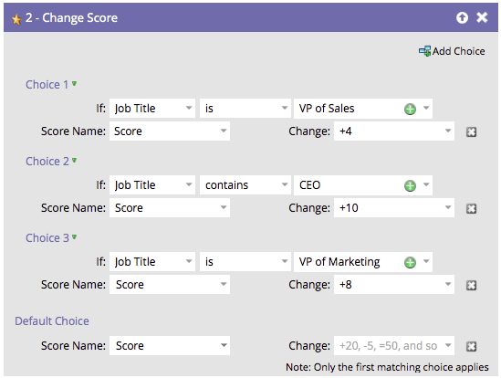

# 在流程步骤中重新排序添加选项 {#reorder-add-choice-in-a-flow-step}

由于只有第一个匹配的选择适用于个人，因此顺序很重要。 如果要更改流程步骤中设置的条件的顺序，请参阅下面的方法。

1. 查找要更改选择顺序的流程步骤。

   

1. 让我们将选项3移到选项2的上方。 单击 **选项3** 然后单击 **上移**.

   >[!NOTE]
   >
   >重新排序时，您可以 **上移**， **下移**，或 **移至**.

   

   做得好！ 现在您知道如何按单增量上下移动选项了。 就是这样！ 重新组织流程步骤选择的顺序非常简单。

   

1. 如果您有许多选择，并且需要向上或向下移动一个多层，则可以使用此替代方法以节省一些时间。 单击要移动的选项，然后在 **移至**，将滑块拖动到要将选项移动到的位置。

   

重新组织流程步骤选择的顺序非常简单。
