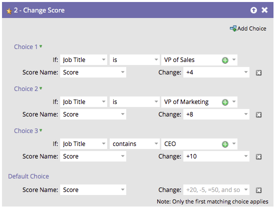

# 重新排序流程步骤中的添加选项 {#reorder-add-choice-in-a-flow-step}

由于只有第一个匹配选择适用于个人，因此排序至关重要。 如果要更改流程步骤中设置的条件的顺序，请按照以下步骤进行操作。

1. 查找要更改选择顺序的流程步骤。

   

1. 在本例中，我们将选择3移到选择2的上方。 单击&#x200B;**[!UICONTROL Choice 3]**，然后单击&#x200B;**[!UICONTROL Move Up]**。

   

   >[!NOTE]
   >
   >重新排序时，您可以&#x200B;**[!UICONTROL Move Up]**、**[!UICONTROL Move Down]**&#x200B;或&#x200B;**[!UICONTROL Move To]**。

   做得好！ 现在您知道如何按单增量上下移动选项了。

   

**可选步骤**：如果您有许多选择，并且需要上下移动一个级别，则可以使用此替代方法节省一些时间。 单击要移动的选项，然后在&#x200B;**[!UICONTROL Move To]**&#x200B;下，将滑块拖动到要移动该选项的位置。

可以轻松重新组织流程步骤选择的顺序。
