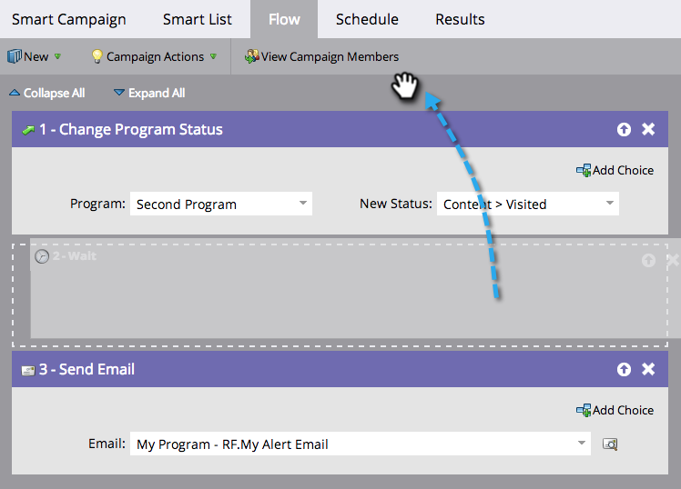

# 重新排序智能营销活动中的流量步骤 {#reorder-the-flow-steps-in-a-smart-campaign}

流程步骤从上到下执行。 下面是如何根据您的需求对流程步骤重新排序的。

>[!PREREQUISITES]
>
>[向智能营销活动添加流程步骤](/help/marketo/product-docs/core-marketo-concepts/smart-campaigns/flow-actions/add-a-flow-step-to-a-smart-campaign.md)

1. 在Smart Campaign **[!UICONTROL 流量]**&#x200B;选项卡中，只需将流量步骤拖放到所需的位置。

>[!NOTE]
>
>流步骤按照它们在流中出现的顺序运行。
