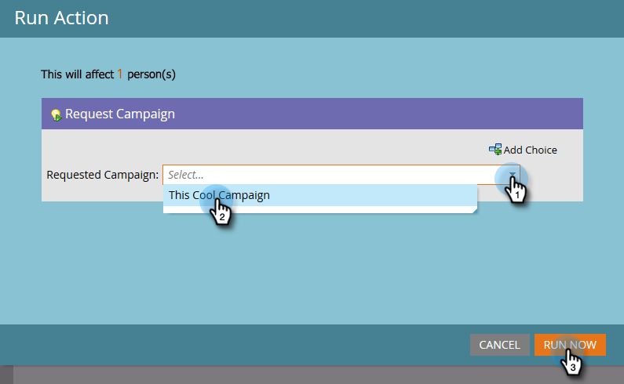

# 请求营销活动 {#request-campaign}

您可以使用“[!UICONTROL Request Campaign]”单流程步骤将人员放入特定营销活动。

>[!NOTE]
>
>您要将人员放置到其中的营销活动必须处于活动状态，并且具有[已请求营销活动](/help/marketo/product-docs/core-marketo-concepts/smart-campaigns/using-smart-campaigns/setting-up-a-trigger-smart-campaign-for-sales-using-campaign-is-requested.md){target="_blank"}触发器。

1. 在&#x200B;**[!UICONTROL Database]**&#x200B;中，查找并选择所需的人员。

   

1. 单击&#x200B;**[!UICONTROL Person Actions]**，将鼠标悬停在&#x200B;**[!UICONTROL Special]**&#x200B;上，然后选择&#x200B;**[!UICONTROL Request Campaign]**。

   

1. 选择要将人员放入其中的营销活动，然后单击&#x200B;**[!UICONTROL Run Now]**。

   

1. 在屏幕的右上角，您将会看到操作何时完成。 单击 **[!UICONTROL View Results]**。

   

   您的人员现在位于请求的营销活动中。

   

   做得很棒！

>[!TIP]
>
>使用&quot;[!UICONTROL Campaign is Requested]&quot;触发器或筛选器查找受此流程步骤影响的人员。
