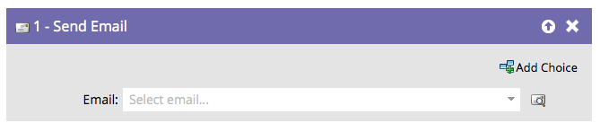

# 发送电子邮件 {#send-email}

## 概述 {#overview}

的 **发送电子邮件** “流量”步骤可用作营销活动的一部分，或用作向用户发送电子邮件的单一流量步骤。

## 使用情况 {#usage}

您可以直接从流程步骤中预览选定的电子邮件。

1. 查找并选择要发送的电子邮件。

   

   >[!NOTE]
   >
   >如果要在流程步骤中选择您的电子邮件，则必须获得批准。

1. 单击预览图标可查看当前选定的电子邮件。

   

此时将打开一个新的选项卡/窗口，您可以在其中看到电子邮件。
