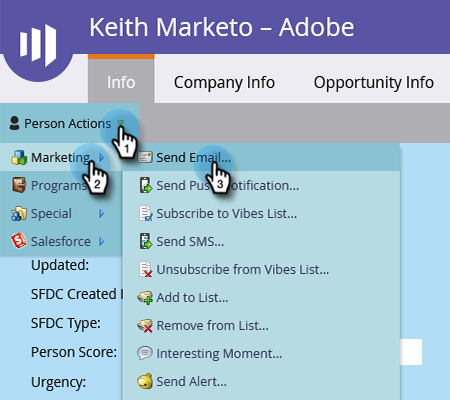

# “人员详细信息”页面中的单一流量操作 {#single-flow-actions-from-person-detail-page}

除了在智能列表中运行单个流量操作之外，您还可以直接在人员详细信息页面上运行它们。

1. 单击&#x200B;**Database**。

   

1. 找到所需的人员。

   

1. 单击&#x200B;**人员操作**&#x200B;下拉列表，然后选择所选的流程步骤。 在本例中，我们将使用[发送电子邮件](/help/marketo/product-docs/core-marketo-concepts/smart-campaigns/flow-actions/send-email.md)。

   

1. 选择所需的电子邮件，然后单击&#x200B;**立即运行**。

   

>[!NOTE]
>
>如果您直接导航到“人员详细信息”页面（即通过链接），而不是从与工作区绑定的页面/资产中导航，则必须在步骤4中选择一个工作区。
