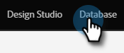

# 从人员详情页执行单个流程操作 {#single-flow-actions-from-person-detail-page}

除了从智能列表中运行单个流程操作外，您还可以直接在“人员详细信息”页面上运行它们。

1. 单击 **[!UICONTROL Database]**。

   

1. 找到所需的人员。

   

1. 单击&#x200B;**[!UICONTROL Person Actions]**&#x200B;下拉列表并选择您选择的流程步骤。 在此示例中，我们将使用[发送电子邮件](/help/marketo/product-docs/core-marketo-concepts/smart-campaigns/flow-actions/send-email.md){target="_blank"}。

   

1. 选择所需的电子邮件并单击&#x200B;**[!UICONTROL Run Now]**。

   

>[!NOTE]
>
>如果您的实例包含工作区/分区，并且您直接导航到“人员详细信息”页面（例如，通过链接），而不是来自与Workspace绑定的页面/资源，则您还必须在步骤4中选择Workspace。
