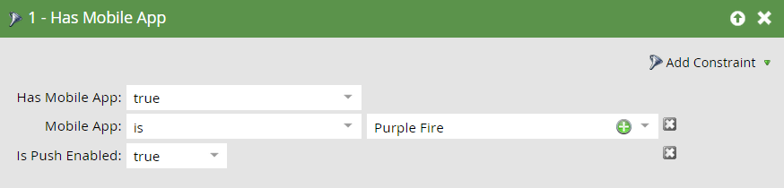

# 移动智能活动{#triggers-and-filters-for-mobile-smart-campaigns}的触发器和过滤器

您可以为移动应用程序智能活动设置触发器和过滤器。

对于大多数活动，有触发器、过滤器和不活动过滤器。 使用不活动过滤器跟踪&#x200B;*未*&#x200B;发生的操作，如点击推送通知。

* 已安装/已安装移动应用程序
* 已打开/已打开移动应用程序
* 已/已有移动应用程序活动
* Has/Had移动应用程序会话
* 点按/点按移动推送通知

只有此活动的过滤器:

* 已发送推送通知 — 过滤器和不活动过滤器

在右侧面板中搜索&#x200B;**移动应用程序**&#x200B;以列表所有移动应用程序触发器和过滤器。

## 约束{#constraints}

对触发器和过滤器使用约束进一步对数据进行排序。

除“已发送推送通知”外，所有触发器和过滤器都包含以下两个标准约束：

* 设备类型 — iPod、iPhone、iPhone 6 Plus、iPad mini、iPad、Android智能手机、Android平板电脑、未知(这是预设列表)

* 平台 — iPhone或Android

某些触发器和过滤器会优惠其他限制，例如：

* 应用程序版本 — 一种目标未使用最新版本的用户的方式。 例如，如果最新的应用程序版本为2.0，则可以使用它查找不在应用程序版本2.0上的人员

* 安装源 — 当前，唯一的选项是API

* 区域设置 — 设备上的设置

* 移动应用程序 — 特定应用程序的名称。 用于指定是否有多个

* 平台版本 — 操作系统版本

* 会话长度（秒） — 应用程序在前景中的会话时间

* 是否启用推送 — **True**&#x200B;表示可发送推送通知。 **** 谎言意味着他们做不到；例如，此人可能已选择不接收推送通知

## 触发器和过滤器{#triggers-and-filters}

**具有移动应用程序**

使用此过滤器可查找所有已安装过您的应用程序的人员。 这仅作为过滤器可用。

>[!NOTE]
>
>过滤器将发现当前安装和以前安装，因为Marketo不跟踪应用程序卸载。

**约束**:设备类型、平台、移动应用程序、移动应用程序版本、设备类型、安装源、启用推送和区域设置

>[!TIP]
>
>在定义应接收推送通知的智能列表时，最好指定“Has Mobile App = true and Is Push Enabled = true”（移动应用程序为true且启用推送）以及移动应用程序的名称。

已安装/已安装移动应用程序

* 移动应用程序已安装 — 触发器

* 已安装移动应用程序 — 筛选器

* 未安装移动应用程序 — 不活动过滤器

**约束**:设备类型、平台、应用程序版本、区域设置和安装源

已打开/已打开移动应用程序

* 移动应用程序已打开 — 触发器

* 已打开移动应用程序 — 筛选器

* 未打开移动应用程序 — 不活动过滤器

**约束**:设备类型和平台

已/已有移动应用程序活动

这为跟踪自定义移动活动提供了一种强大的方式。 您需要与开发人员合作，为Android](https://developers.marketo.com/documentation/mobile/installation-instructions-on-android)设置跟踪[，为iOS](https://developers.marketo.com/documentation/mobile/installation-instructions-on-ios)设置跟踪[。

* 具有移动应用活动 — 触发器

* 具有移动应用活动 — 过滤器

* 没有移动应用活动 — 不活动过滤器

**约束**:设备类型和平台，外加五个额外类型：

* 操作 — 自定义移动活动

* 操作类型 — （可选）用于对多个操作分类的文本字段

* 操作详细信息 — （可选）提供有关操作的其他信息的文本字段

* 操作量度 — （可选）提供有关操作的附加信息的数字字段（例如，价格）

* 操作长度（秒） — （可选）数字字段，可用于捕获用户完成操作所花费的时间

“操作”约束允许您使用触发器和过滤器来密切跟踪移动活动。

>[!NOTE]
>
>**示例**
>
>在&#x200B;*Shopping*&#x200B;的操作类型下，有一个非常具体的操作，其他约束定义它：
>
>* 买了件衬衫
   >   * 是红色的
   >   * 花了30美元
   >   * 花了20秒才买

以下是Marketo中滤镜的外观：

>[!NOTE]
>
>**示例**
>
>您可以在同一操作类型下有多个操作。 事实上，您的正常购物体验可能包含“购物”下的多个列！ 要不穿袜子？
>
>| 操作类型 | 购物 | 购物 |
>|---|---|---|
>| 操作 | 买的衬衫 | 买裤子 |
>| 操作详细信息 | 颜色 | 颜色 |
>| 操作量度 | 价格 | 价格 |

**Has/Had移动应用程序会话**

* 具有移动应用程序会话 — 触发器

* 具有移动应用程序会话 — 过滤器

* 没有移动应用程序会话 — 不活动过滤器

**约束**:设备类型、平台和会话长度（秒）

点按/点按推送通知

* 点击推送通知 — 触发器

* 点击推送通知 — 过滤器

* 未点击推送通知 — 不活动过滤器

**约束**:设备类型、平台、移动应用程序版本、推送通知和平台版本

>[!TIP]
>
>使用“未点击推送通知”不活动过滤器可查找最近未点击发送给他们的推送通知的用户，以便您可以通过电子邮件跟进。

**已发送推送** 通知此活动仅可用作过滤器。

* 已发送推送通知 — 过滤器

* 未发送推送通知 — 不活动过滤器

**约束**:推送通知和移动应用程序

>[!MORELIKETHIS]
>
>* [向智能列表滤镜添加约束](/help/marketo/product-docs/core-marketo-concepts/smart-lists-and-static-lists/using-smart-lists/add-a-constraint-to-a-smart-list-filter.md)
>* [在智能列表中使用不活动过滤器](/help/marketo/product-docs/core-marketo-concepts/smart-lists-and-static-lists/using-smart-lists/use-inactivity-filters-in-a-smart-list.md)

