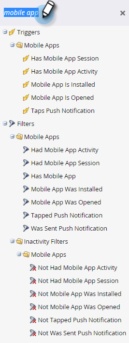
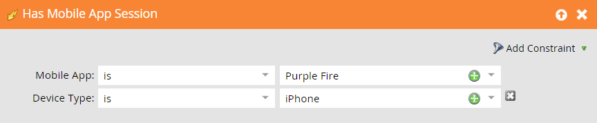

# 适用于移动智能促销活动的触发器和过滤器 {#triggers-and-filters-for-mobile-smart-campaigns}

您可以为移动设备应用程序智能促销活动设置触发器和过滤器。

对于大多数活动，都有触发器、过滤器和不活动过滤器。 使用不活动过滤器跟踪某个操作，例如点按推送通知，该操作 *dind&#39;t* 发生。

* 已安装/已安装移动设备应用程序
* 已打开/已打开移动设备应用程序
* 具有/具有移动设备应用程序活动
* 已/已举行移动设备应用程序会话
* 点按/点按移动设备推送通知

此活动只有过滤器：

* 已发送推送通知 — 过滤器和不活动过滤器

搜索 **移动设备应用程序** 在右侧面板中，列出所有移动设备应用程序触发器和过滤器。

## 约束 {#constraints}

对触发器和过滤器使用限制，以进一步对数据进行排序。

除“已发送推送通知”之外，所有触发器和过滤器都包含以下两个标准限制：

* 设备类型 — iPod、iPhone、iPhone 6 Plus、iPad mini、iPad、Android智能手机、Android平板电脑、未知（这是一个预设列表）

* 平台 — iPhone或Android

某些触发器和过滤器提供了其他限制，例如：

* 应用程序版本 — 一种定位未使用最新版本的用户的方法。 例如，如果最新应用程序版本为2.0，则可以使用它查找应用程序版本2.0中未启用的人员

* 安装源 — 当前，唯一的选项是API

* 区域设置 — 设备上的设置

* 移动设备应用程序 — 特定应用程序的名称。 用于指定是否有多个

* 平台版本 — 操作系统的版本

* 会话长度（秒） — 应用程序处于前台时的会话时间

* 是否启用推送 —  **True** 表示可以发送推送通知。 **False** 意味着他们不能；例如，人员可能已选择不接收推送通知

## 触发器和过滤器 {#triggers-and-filters}

**具有移动设备应用程序**

使用此过滤器可查找已安装您的应用程序的所有用户。 此设置仅可用作过滤器。

>[!NOTE]
>
>该过滤器将找到当前安装和以前的安装，因为Marketo不跟踪应用程序卸载。

**约束**  — 设备类型、平台、移动设备应用程序、移动设备应用程序版本、设备类型、安装源、启用推送以及区域设置

>[!TIP]
>
>最好在定义应接收推送通知的用户的智能列表时，指定移动设备应用程序= true和是否启用推送= true，以及移动设备应用程序的名称。

已安装/已安装移动设备应用程序

* 移动设备应用程序已安装 — 触发器

* 已安装移动设备应用程序 — 筛选器

* 未安装移动设备应用程序 — 非活动过滤器

**约束**  — 设备类型、平台、应用程序版本、区域设置和安装源

已打开/已打开移动设备应用程序

* 移动设备应用程序已打开 — 触发器

* 移动设备应用程序已打开 — 过滤器

* 未打开移动设备应用程序 — 非活动过滤器

**约束**  — 设备类型和平台

具有/具有移动设备应用程序活动

这为跟踪自定义移动设备活动提供了一种有效方法。 您需要与开发人员合作以设置跟踪 [（对于Android）](https://developers.marketo.com/documentation/mobile/installation-instructions-on-android) 和 [对于iOS](https://developers.marketo.com/documentation/mobile/installation-instructions-on-ios).

* 具有移动设备应用程序活动 — 触发器

* 具有移动设备应用程序活动 — 过滤器

* 没有移动设备应用程序活动 — 非活动过滤器

**约束**  — 设备类型、平台、移动设备应用程序版本、区域设置、平台版本，以及五个其他版本：

* 操作 — 自定义移动设备活动

* 操作类型 — （可选）用于对多个操作进行分类的文本字段

* 操作详细信息 — （可选）文本字段，提供有关操作的其他信息

* 操作量度 — （可选）数字字段，提供有关操作的其他信息（例如，价格）

* 操作长度（秒） — （可选）数字字段，用于捕获用户完成操作所花费的时长

通过操作限制，您可以使用触发器和过滤器非常密切地跟踪移动设备活动。

>[!NOTE]
>
>**示例**
>
>在操作类型下 *购物*，下面是一个非常具体的操作，其他约束条件定义了该操作：
>
>* 买了件衬衫
   >   * 是红色的
   >   * 花了30美元
   >   * 花了20秒才买完

以下是过滤器在Marketo中的外观：

>[!NOTE]
>
>**示例**
>
>您可以在同一操作类型下执行多个操作。 事实上，您的正常购物体验可能包含“Shopping！”下的多个列。 要不要一些袜子呢？
>
>| 操作类型 | 购物 | 购物 |
>|---|---|---|
>| 操作 | 购买的衬衫 | 买了裤子 |
>| 操作详细信息 | 颜色 | 颜色 |
>| 操作量度 | 价格 | 价格 |

**已/已举行移动设备应用程序会话**

* 具有移动设备应用程序会话 — 触发器

* 具有移动设备应用程序会话 — 过滤器

* 没有移动设备应用程序会话 — 非活动过滤器

**约束**  — 设备类型、平台和会话长度（秒）

点按/点按推送通知

* 点按推送通知 — 触发器

* 点按推送通知 — 过滤器

* 未点按推送通知 — 非活动过滤器

**约束**  — 设备类型、平台、移动设备应用程序版本、推送通知和平台版本

>[!TIP]
>
>使用未点按推送通知非活动状态筛选器可查找最近未点按发送给他们的推送通知的用户，以便您可以通过电子邮件跟踪。

**已发送推送通知** 此活动仅可用作过滤器。

* 已发送推送通知 — 过滤器

* 未发送推送通知 — 非活动过滤器

**约束**  — 推送通知和移动设备应用程序

>[!MORELIKETHIS]
>
>* [向智能列表筛选器添加约束](/help/marketo/product-docs/core-marketo-concepts/smart-lists-and-static-lists/using-smart-lists/add-a-constraint-to-a-smart-list-filter.md)
>* [在智能列表中使用不活动过滤器](/help/marketo/product-docs/core-marketo-concepts/smart-lists-and-static-lists/using-smart-lists/use-inactivity-filters-in-a-smart-list.md)

