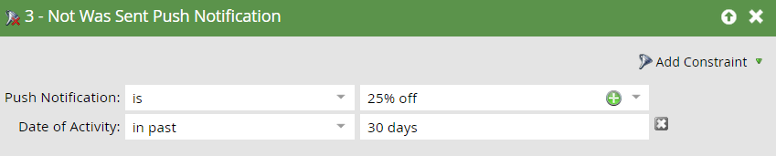

# 移动端智能营销活动的触发器与过滤器 {#triggers-and-filters-for-mobile-smart-campaigns}

您可以为移动设备应用程序Smart Campaign设置触发器和过滤器。

对于大多数活动，都有一个触发器、一个过滤器和一个非活动状态过滤器。 使用非活动筛选器跟踪未发生&#x200B;_的操作，例如点击推送通知。_

* 已安装移动设备应用程序
* 移动设备应用程序已打开
* 具有/曾经具有移动设备应用程序活动
* 具有/曾具有移动设备应用程序会话
* 点按/点按移动推送通知

此活动只有过滤器：

* 已发送推送通知 — 筛选器和非活动筛选器

在右侧面板中搜索“移动设备应用程序”，可列出所有移动设备应用程序触发器和过滤器。

## 约束 {#constraints}

将约束与触发器和过滤器结合使用可进一步对数据进行排序。

除“已发送推送通知”之外的所有触发器和过滤器都包含这两个标准约束：

* 设备类型 — [!DNL iPod]、iPhone、[!DNL iPhone 6 Plus]、[!DNL iPad mini]、iPad、Android智能手机、Android平板电脑、未知（这是预设列表）

* 平台 — iPhone或Android

某些触发器和过滤器提供了额外的限制，例如：

* 应用程序版本 — 一种定位未使用最新版本的用户的方法。 例如，如果最新的应用程序版本为2.0，则可以使用该版本查找未在应用程序版本2.0上运行的人员

* 安装Source — 当前，唯一选项是API

* 区域设置 — 设备上的设置

* 移动设备应用程序 — 特定应用程序的名称。 用于指定您是否有多个

* 平台版本 — 操作系统的版本

* 会话时长（秒） — 应用程序处于前台时的会话时间

* 是否启用推送 — **True**&#x200B;表示可以发送推送通知。 **False**&#x200B;表示他们无法接收推送通知；例如，用户可能选择不接收推送通知

## 触发器和过滤器 {#triggers-and-filters}

**具有移动应用**

使用此过滤器查找曾安装过您的应用程序的所有人员。 这仅作为过滤器提供。

>[!NOTE]
>
>由于Marketo不会跟踪应用程序的卸载情况，因此过滤器会找到当前安装次数和以前安装次数。

**约束** — 设备类型、平台、移动应用程序、移动应用程序版本、设备类型、安装Source、启用推送以及区域设置

>[!TIP]
>
>最佳实践是，在定义应接收推送通知的用户的智能列表时，指定具有移动设备应用程序= true且已启用推送= true ，以及移动设备应用程序的名称。

已安装移动设备应用程序

* 移动应用程序已安装 — 触发器

* 已安装移动设备应用程序 — 过滤器

* 未安装移动设备应用程序 — 非活动状态过滤器

**约束** — 设备类型、平台、应用程序版本、区域设置和安装Source

移动设备应用程序已打开

* 移动设备应用程序已打开 — 触发器

* 已打开移动设备应用程序 — 过滤器

* 未打开移动设备应用程序 — 非活动状态过滤器

**约束** — 设备类型和平台

具有/曾经具有移动设备应用程序活动

这提供了一种强大的方法来跟踪自定义移动活动。 您需要与开发人员合作，为Android[设置跟踪](https://experienceleague.adobe.com/zh-hans/docs/marketo-developer/marketo/mobile/installation#how-to-install-marketo-sdk-on-android){target="_blank"}，为iOS[设置跟踪](https://experienceleague.adobe.com/zh-hans/docs/marketo-developer/marketo/mobile/installation#install-marketo-sdk-on-ios){target="_blank"}。

* 具有移动设备应用程序活动 — 触发器

* 具有移动设备应用程序活动 — 过滤器

* 没有移动设备应用程序活动 — 非活动过滤器

**约束** — 设备类型、平台、移动应用程序版本、区域设置、平台版本以及五个其他限制：

* 操作 — 自定义移动活动

* 操作类型 — （可选）用于对多个操作进行分类的文本字段

* 操作详细信息 — （可选）提供有关操作的附加信息的文本字段

* 操作量度 — （可选）提供有关操作的附加信息的数字字段（例如价格）

* 操作长度（秒） — （可选）数字字段，可用于捕获用户完成操作所用的时间

利用操作约束，您可以使用触发器和过滤器非常密切地跟踪移动活动。

>[!NOTE]
>
>**示例**
>
>在&#x200B;_Shopping_&#x200B;的操作类型下，以下是一个非常具体的操作，其他约束定义了该操作：
>
>* 买了一件衬衫
>   * 是红色的
>   * 它花费30美元
>   * 花了20秒才买到

以下是该过滤器在Marketo中的外观：

>[!NOTE]
>
>**示例**
>
>同一操作类型下可以有多个操作。 事实上，您的正常购物体验可能涉及“购物”下的多个列！ 穿袜子去吧？
>
>| 操作类型 | 购物 | 购物 |
>|---|---|---|
>| 操作 | 买的衬衫 | 买的裤子 |
>| 操作详细信息 | 颜色 | 颜色 |
>| 操作量度 | 价格 | 价格 |

**已/有移动应用会话**

* 具有移动应用程序会话 — 触发器

* 拥有移动应用程序会话 — 过滤器

* 没有移动应用程序会话 — 非活动过滤器

**约束** — 设备类型、平台和会话长度（秒）

点按/点按推送通知

* 点按推送通知 — 触发器

* 点按推送通知 — 过滤器

* 未点击推送通知 — 非活动过滤器

**约束** — 设备类型、平台、移动应用程序版本、推送通知和平台版本

>[!TIP]
>
>使用未点击推送通知不活动过滤器查找最近发送给他们的未点击推送通知的用户，以便您可以通过电子邮件进行跟踪。

**已发送推送通知**&#x200B;此活动仅可作为过滤器使用。

* 已发送推送通知 — 过滤器

* 未发送推送通知 — 非活动过滤器

**约束** — 推送通知和移动应用

>[!MORELIKETHIS]
>
>* [向智能列表筛选器添加约束](/help/marketo/product-docs/core-marketo-concepts/smart-lists-and-static-lists/using-smart-lists/add-a-constraint-to-a-smart-list-filter.md){target="_blank"}
>* [在智能列表中使用非活动筛选器](/help/marketo/product-docs/core-marketo-concepts/smart-lists-and-static-lists/using-smart-lists/use-inactivity-filters-in-a-smart-list.md){target="_blank"}
