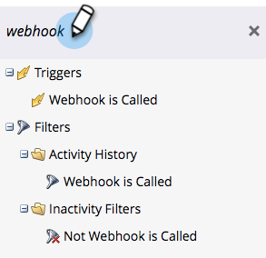

# 在Smart Campaign中使用Webhook {#use-a-webhook-in-a-smart-campaign}

要使用[webhook](https://experienceleague.adobe.com/en/docs/marketo-developer/marketo/webhooks/webhooks){target="_blank"}，请将其作为流量操作添加到[智能营销活动](/help/marketo/product-docs/core-marketo-concepts/smart-campaigns/flow-actions/add-a-flow-step-to-a-smart-campaign.md){target="_blank"}。

>[!AVAILABILITY]
>
>并非所有Marketo Engage用户都已购买此功能。 有关详细信息，请联系Adobe客户团队（您的客户经理）。

1. [创建Smart Campaign](/help/marketo/product-docs/core-marketo-concepts/smart-campaigns/creating-a-smart-campaign/create-a-new-smart-campaign.md){target="_blank"}。

   >[!NOTE]
   >
   >Webhook只能在触发器营销活动中使用。

1. 转到&#x200B;**[!UICONTROL Flow]**&#x200B;选项卡并拖入&#x200B;**[!UICONTROL Call Webhook]**&#x200B;流操作。

   

1. 选择 **[!UICONTROL Webhook]**。

   

1. 您还可以在智能列表中使用Webhook。

   

1. 最后，您可以在流程步骤的&#x200B;**[!UICONTROL Add Choice]**&#x200B;中使用Webhook。

   
