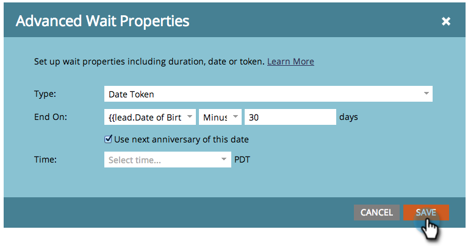

# 在等待流步骤{#use-a-date-token-in-a-wait-flow-step}中使用日期令牌

您可以使用等待流程步骤暂停个人在智能活动中的旅程，直到使用日期令牌的特定日期为止。 您还可以按某些天数修改结束日期。

>[!NOTE]
>
>这仅适用于触发活动。 不能在批处理活动中使用此功能。

1. 在您的智能活动&#x200B;**流**&#x200B;选项卡中，拖动到&#x200B;**等待**&#x200B;流步骤上。

   

1. 单击右侧的齿轮图标。

   

1. 从&#x200B;**类型**&#x200B;下拉列表中，选择&#x200B;**日期令牌**。

   

1. 选择日期标记以指定等待步骤何时结束：

   * `{{my._____}}`
   * `{{lead.______}}`
   * `{{company.______}}`
   * `{{system._______}}`

   

1. 要等到当前日历年度或下一个日历年度中日期的下一个周年日，请选中此框。

   

   >[!TIP]
   >
   >在日期令牌中使用此选项，该令牌指的是过去的日期，如生日或合同开始。

1. （可选）您可以按指定的天数修改结束日期。

   

   >[!NOTE]
   >
   >您还可以使用表示整数字段的`{{lead.`或`{{company.`标记或数字类型的`{{my.`标记指定天数。

1. 单击&#x200B;**保存**。

   

   >[!MORELIKETHIS]
   >
   >* [在等待流步骤中使用持续时间](/help/marketo/product-docs/core-marketo-concepts/smart-campaigns/flow-actions/wait/use-a-duration-in-a-wait-flow-step.md)
   >* [在等待流程步骤中使用特定日期](/help/marketo/product-docs/core-marketo-concepts/smart-campaigns/flow-actions/wait/use-a-specific-date-in-a-wait-flow-step.md)

