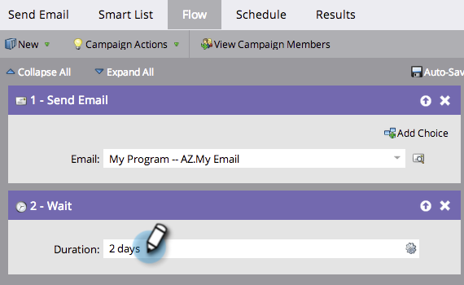

# 在等待流程步骤中使用时长 {#use-a-duration-in-a-wait-flow-step}

您可以使用等待流步骤暂停人员通过智能营销活动进行一段特定时间的旅程。 您还可以指定星期几和结束时间的标准。

1. 在Smart Campaign **[!UICONTROL Flow]**&#x200B;选项卡中，拖动&#x200B;**[!UICONTROL Wait]**&#x200B;流程步骤。

   

1. 输入要暂停的时间。

   

1. 操作完成！流将暂停指定的持续时间。 对于高级选项，单击右侧的齿轮图标。

   

1. 指定在一周中等待步骤应该结束的日期。

   

1. （可选）指定时间。 单击 **[!UICONTROL Save]**。

   

   >[!NOTE]
   >
   >**示例**
   >
   >周五，下午5点，系统会触发一个Smart Campaign。 等待步骤是高级步骤：48小时，必须在周一至周五上午9点结束。
   >
   >结果该人员将在&#x200B;**星期一上午9点**&#x200B;继续进入流。 这是48小时后的第一个M-F日期。

   >[!NOTE]
   >
   >使用的持续时间、日期、时间和天数均基于您的订阅所在时区。

   >[!MORELIKETHIS]
   >
   >* [在等待流步骤](/help/marketo/product-docs/core-marketo-concepts/smart-campaigns/flow-actions/wait/use-a-specific-date-in-a-wait-flow-step.md){target="_blank"}中使用特定日期
   >* [在等待流步骤](/help/marketo/product-docs/core-marketo-concepts/smart-campaigns/flow-actions/wait/use-a-date-token-in-a-wait-flow-step.md){target="_blank"}中使用日期令牌
