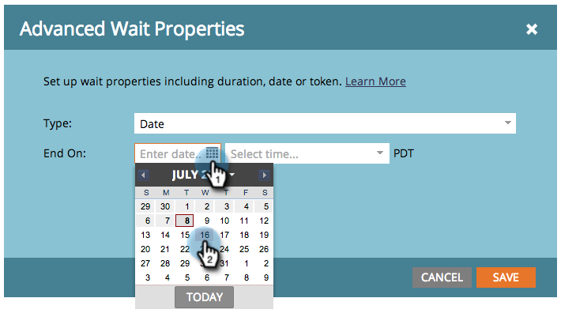

# 在等待流步骤中使用特定日期 {#use-a-specific-date-in-a-wait-flow-step}

您可以使用“[!UICONTROL 等待]”流程步骤暂停人员通过Smart Campaign的历程，直到特定日期为止。

1. 在Smart Campaign **[!UICONTROL 流量]**&#x200B;选项卡中，拖动到&#x200B;**[!UICONTROL 等待]**&#x200B;流量步骤。

   

1. 单击齿轮图标。

   

1. 从&#x200B;**[!UICONTROL 类型]**&#x200B;下拉列表中，选择&#x200B;**[!UICONTROL 日期]**。

   

1. 选择您希望恢复的特定日期。

   

1. 指定时间（可选），然后单击&#x200B;**[!UICONTROL 保存]**。

   

>[!MORELIKETHIS]
>
>* [在等待流步骤](/help/marketo/product-docs/core-marketo-concepts/smart-campaigns/flow-actions/wait/use-a-duration-in-a-wait-flow-step.md){target="_blank"}中使用持续时间
>* [在等待流步骤](/help/marketo/product-docs/core-marketo-concepts/smart-campaigns/flow-actions/wait/use-a-date-token-in-a-wait-flow-step.md){target="_blank"}中使用日期令牌
