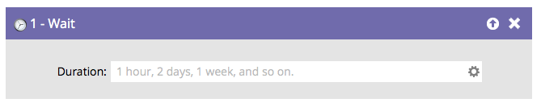

# 等待 {#wait}

## 概述 {#overview}

在智能营销活动流程中暂停人员，并使用 **等待步骤**.

请注意，您如何以自然语言键入内容，如“4小时”。 做 **not**&#x200B;但是，请使用缩写（即4小时）。 智能营销活动仍将运行，但等待步骤将被忽略。

>[!CAUTION]
>
>更改等待步骤的持续时间不会影响已输入该步骤的人员。 例如：您的等待步骤为5天，人员进入该步骤，然后将等待步骤更改为7天 — 该人员仍将仅等待原始的5天，然后才进入下一个流程步骤。

>[!TIP]
>
>如果有人已经处于等待步骤，并且您不希望他们在等待期结束后继续，请插入 [从流中删除](/help/marketo/product-docs/core-marketo-concepts/smart-campaigns/flow-actions/remove-from-flow.md) 就在等待步骤之后。 使用 [添加选择](/help/marketo/product-docs/core-marketo-concepts/smart-campaigns/flow-actions/use-add-choice-in-a-flow-step.md) 选项。

## 使用情况 {#usage}

使用等待流程步骤的主要方法有三种：

1. [在等待流程步骤中使用持续时间](/help/marketo/product-docs/core-marketo-concepts/smart-campaigns/flow-actions/wait/use-a-duration-in-a-wait-flow-step.md)
1. [在等待流程步骤中使用特定日期](/help/marketo/product-docs/core-marketo-concepts/smart-campaigns/flow-actions/wait/use-a-specific-date-in-a-wait-flow-step.md)
1. [在等待流程步骤中使用日期令牌](/help/marketo/product-docs/core-marketo-concepts/smart-campaigns/flow-actions/wait/use-a-date-token-in-a-wait-flow-step.md)
