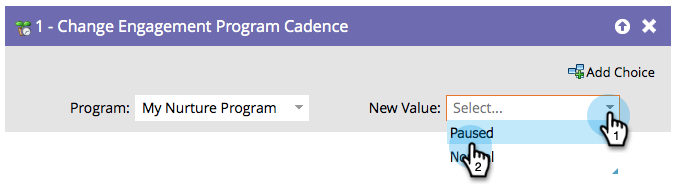

# 更改参与项目节奏 {#change-engagement-program-cadence}

一旦通过参与计划培养了某人，您就可以使用此流动步骤暂时停止培养他们。

>[!NOTE]
>
>如果某个人不是项目群成员，并在此流程步骤中运行，则将自动将其添加为成员并添加到您的第一个流中。

1. 选择参与计划。

   

1. 选择&#x200B;**[!UICONTROL Paused]**&#x200B;作为&#x200B;**[!UICONTROL New Value]**&#x200B;以阻止人员接收内容。

   

如果您希望人员重新开始接收内容，可以将他们重新设置为&#x200B;**[!UICONTROL Normal]**。
