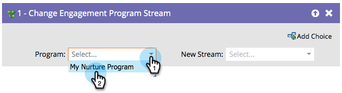

# 更改参与度项目流 {#change-engagement-program-stream}

## 概述 {#overview}

通常，您会使用 [流过渡规则](/help/marketo/product-docs/email-marketing/drip-nurturing/engagement-program-streams/transition-people-between-engagement-streams.md) 要实现此目的，但如果要手动将人员从一个流移动到另一个流，请使用此流步骤。

## 使用情况 {#usage}

1. 选择要将人员移动到的参与计划。

   >[!NOTE]
   >
   >如果您选择其他项目，它将将人员保留在其当前流中，并将其添加到新项目。

   

1. 选择要将人员添加到的流。

   

就这样！
