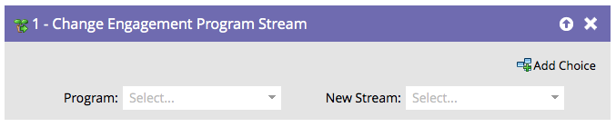

# 更改参与项目流 {#change-engagement-program-stream}

通常，您可以使用[流过渡规则](/help/marketo/product-docs/email-marketing/drip-nurturing/engagement-program-streams/transition-people-between-engagement-streams.md)来实现此目的。 但是，如果您想要手动将人员从一个流移动到另一个流，则需要使用此流步骤。

1. 选择要将人员移动到的参与计划。

   >[!NOTE]
   >
   >如果您选择其他项目，该项目会将用户保留在其当前流中，并将他们添加到新流中。

   

1. 选择要将您的人员添加到的流。

   

就是这样！
