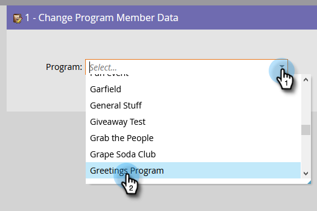
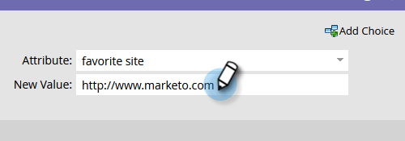

# 更改项目成员数据{#change-program-member-data}

您可以使用Marketo通过“更改数据值”流动操作来更新字段的值。

>[!NOTE]
>
>您还可以阻止更新字段。 有关详细信息，请参阅阻止对字段的更新。

1. 在智能活动的“流”选项卡中，调出&#x200B;**更改项目成员数据**&#x200B;流步骤并选择所需的项目。

   

1. 查找并选择要更改其值的属性。

   

1. 输入所需的“属性”值。

   

>[!NOTE]
>
>您还可以在“新值”中使用令牌。

现在，运行智能活动，您就完成！

>[!TIP]
>
>如果要清除字段而不是更新字段，可以输入“NULL”（无引号，所有大写）作为“新值”。

>[!MORELIKETHIS]
>
>* [在流步骤中使用令牌](/help/marketo/product-docs/core-marketo-concepts/smart-campaigns/flow-actions/use-tokens-in-flow-steps.md)
>* [将数据附加到字段](/help/marketo/product-docs/core-marketo-concepts/smart-campaigns/flow-actions/append-data-to-a-field.md)

