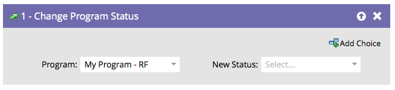

# 更改项目状态 {#change-program-status}

项目状态可帮助您跟踪人员通过项目或事件的进展情况。 在[自定义、创建和管理渠道](/help/marketo/product-docs/administration/tags/create-a-program-channel.md){target="_blank"}中查找更多信息。

>[!CAUTION]
>
>更改参与计划中的计划状态会自动将其添加到第一个流。 他们将开始接收内容。

1. 拖入&#x200B;**[!UICONTROL Change Program Status]**&#x200B;流程步骤。

   

1. 选择要设置的&#x200B;**[!UICONTROL New Status]**。 此人如果还不是计划成员，则也将成为该计划成员。

   

选项仅限于该程序的有效状态。

>[!NOTE]
>
>人员无法向后移动到“管理员”渠道编辑器中定义的早期项目状态。

状态是用于跟踪人员和报告的强大工具。
