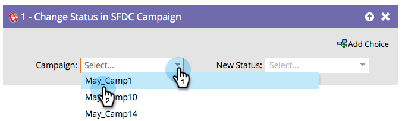

# 在SFDC Campaign中更改状态 {#change-status-in-sfdc-campaign}

此流程步骤允许您更改潜在客户的Salesforce营销活动成员状态。

>[!NOTE]
>
>仅在与Salesforce集成时可用。

如果潜在客户在Salesforce中不存在或还不是营销活动的成员，则会自动将其同步并以适当的状态添加到Salesforce营销活动。

1. 首先查找并选择记录所在的Salesforce **[!UICONTROL 营销活动]**。

   

1. 然后，选择要设置的&#x200B;**[!UICONTROL 新状态]**，操作已完成！

   
