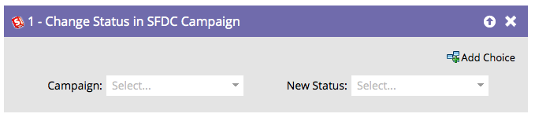

# 更改 SFDC 营销活动中的状态 {#change-status-in-sfdc-campaign}

此流程步骤允许您更改潜在客户的Salesforce营销活动成员状态。

>[!NOTE]
>
>仅在与[!DNL Salesforce]集成时可用。

如果潜在客户在Salesforce中不存在或还不是营销策划的成员，则会自动将其同步并以适当的状态添加到Salesforce营销策划。

1. 首先查找并选择记录所在的Salesforce **[!UICONTROL Campaign]**。

   

1. 然后，选择要设置的&#x200B;**[!UICONTROL New Status]**，操作即完成！

   
