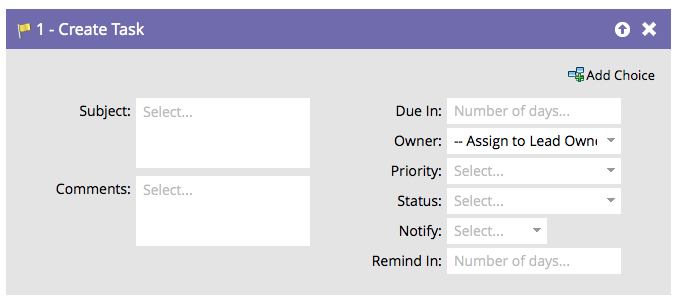

# 创建任务 {#create-task}

作为营销人员，您掌握的信息可帮助销售人员完成交易。 您可以创建任务，以告知他们应该做什么以及何时应该做什么。

>[!NOTE]
>
>当Marketo同步用户创建任务时，**[!UICONTROL Due In]**&#x200B;是要在Salesforce中创建任务的必填字段。 如果没有值，Marketo将默认输入5天。

默认情况下，流程步骤将如下所示：

自定义所有字段以您希望的方式创建任务。

>[!TIP]
>
>您可以在`{{lead.tokens}}`和`{{company.tokens}}`中使用`{{campaign.tokens}}`、`{{system.tokens}}`、**[!UICONTROL Subject]**&#x200B;和&#x200B;**[!UICONTROL Description]**。 有关更多详细信息，请参阅流程步骤[令牌](/help/marketo/product-docs/core-marketo-concepts/smart-campaigns/flow-actions/use-tokens-in-flow-steps.md){target="_blank"}。
