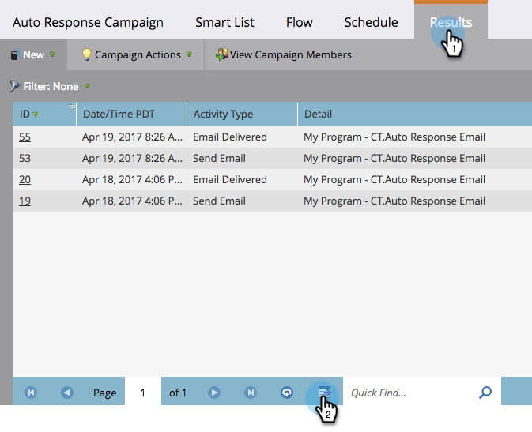

# 将智能活动结果导出到Excel {#export-smart-campaign-results-to-excel}

将您的智能活动结果导出到Excel，以便在Marketo之外使用。

1. 在智能活动中，单击&#x200B;**结果**，然后单击底部的导出图标。

   

   很快，您的结果就会导出并准备好使用！

   >[!NOTE]
   >
   >导出限制为20,000行。 Excel文件将保存在浏览器的默认下载文件夹中。
