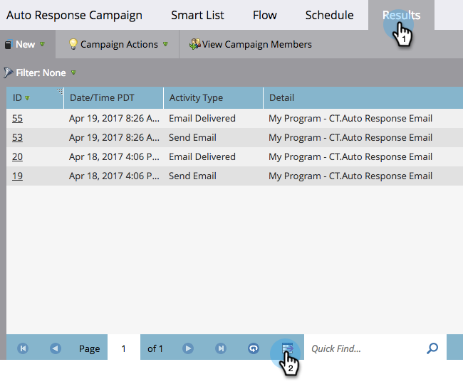

# 将Smart Campaign结果导出到[!DNL Excel] {#export-smart-campaign-results-to-excel}

将Smart Campaign结果导出到Excel以供在Marketo Engage之外使用。

1. 在Smart Campaign中，单击&#x200B;**[!UICONTROL Results]**&#x200B;选项卡，然后单击底部的导出图标。

   

   您的结果已导出并可供使用！

   >[!NOTE]
   >
   >导出限制为20,000行。 [!DNL Excel]文件保存在浏览器的默认下载文件夹中。
