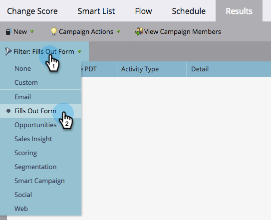

# 过滤智能营销活动结果 {#filter-smart-campaign-results}

>[!PREREQUISITES]
>
>[查看智能营销活动结果](/help/marketo/product-docs/core-marketo-concepts/smart-campaigns/smart-campaign-data/view-smart-campaign-results.md)

过滤智能营销活动结果，以查看对您有影响的特定活动。

## 按保存的过滤器过滤 {#filter-by-saved-filters}

1. 在您的智能营销活动中 **结果** ，单击 **过滤器** ，然后选择保存的过滤器。

   

   >[!NOTE]
   >
   >默认情况下，不应用任何过滤器，结果会显示所有活动。

## 创建自定义过滤器 {#create-a-custom-filter}

1. 单击 **过滤器** 然后 **自定义**.

   

1. 选择要查看的活动类型，然后单击 **另存为** .

   

   >[!TIP]
   >
   >单击 **应用** 直接将自定义过滤器应用于结果而不保存。

1. 输入过滤器名称并单击 **保存**.

   

1. 自定义过滤器将应用于您的结果，并且现在在下拉列表中可用（您可能需要刷新页面才能在下拉列表中看到它）。

   

   这很酷吗？ 现在，您的自定义过滤器可用于所有活动日志。
