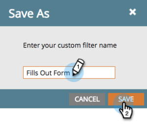

# 筛选智能营销活动结果 {#filter-smart-campaign-results}

>[!PREREQUISITES]
>
>[查看Smart Campaign结果](/help/marketo/product-docs/core-marketo-concepts/smart-campaigns/smart-campaign-data/view-smart-campaign-results.md)

筛选Smart Campaign结果以查看对您而言重要的特定活动。

## 按保存的筛选条件筛选 {#filter-by-saved-filters}

1. 在Smart Campaign **[!UICONTROL 结果]**&#x200B;选项卡中，单击&#x200B;**[!UICONTROL 筛选器]**&#x200B;并选择保存的筛选器。

   

   >[!NOTE]
   >
   >默认情况下，不应用任何过滤器，结果将显示所有活动。

## 创建自定义筛选器 {#create-a-custom-filter}

1. 单击&#x200B;**[!UICONTROL 筛选器]**，然后单击&#x200B;**[!UICONTROL 自定义]**。

   

1. 选择要查看的活动类型，然后单击&#x200B;**[!UICONTROL 另存为]**。

   

   >[!TIP]
   >
   >单击&#x200B;**[!UICONTROL 应用]**&#x200B;直接将自定义筛选器应用到您的结果，而不保存它。

1. 输入筛选器名称，然后单击&#x200B;**[!UICONTROL 保存]**。

   

1. 自定义筛选条件将应用于您的结果，现在可在下拉列表中找到（您可能需要刷新页面才能在下拉列表中看到它）。

   
