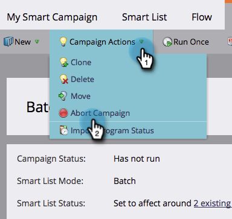

# 中止智能活动{#abort-a-smart-campaign}

>[!CAUTION]
>
>仅供紧急使用

有时，你启动一个智能活动，并立即意识到这是个错误。 下面介绍如何在中途拉紧紧急刹车并停止智能活动。

1. 在&#x200B;**营销活动**&#x200B;下，选择您的智能活动并转到&#x200B;**计划**&#x200B;选项卡。

   

1. 单击**活动操作**下拉列表。 选择&#x200B;**中止活动**。

   

1. 单击&#x200B;**中止**&#x200B;进行确认。

   

   >[!NOTE]
   >
   >**提醒**
   >
   >
   >中止操作不会撤消已完成的步骤，只是会阻止执行更多步骤。 (示例：无法取消发送电子邮件。)

   

   >[!NOTE]
   >
   >查看智能活动的&#x200B;**结果**&#x200B;选项卡，了解中止操作之前所执行的操作。 您还将找到[通知](../../../../product-docs/core-marketo-concepts/miscellaneous/understanding-notifications.md)，其中包含其他详细信息。

   >[!TIP]
   >
   >想在触发活动中从流中删除人吗？ 查看[从流](../../../../product-docs/core-marketo-concepts/smart-campaigns/flow-actions/remove-from-flow.md)中删除。

总是多次检查您的工作，但此紧急制动器将来可能会派上用场。