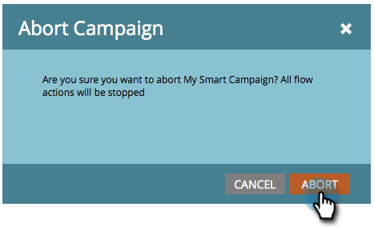

# 中止智能营销活动 {#abort-a-smart-campaign}

>[!CAUTION]
>
>仅供紧急使用

有时，您启动智能营销活动后，会立即意识到这是一个错误。 执行以下步骤以停止Smart Campaign中期运行。

1. 选择所需的Smart Campaign并单击&#x200B;**[!UICONTROL Schedule]**&#x200B;选项卡。

   

1. 单击&#x200B;**[!UICONTROL Campaign Actions]**&#x200B;下拉列表。 选择 **[!UICONTROL Abort Campaign]**。

   

1. 单击 **[!UICONTROL Abort]** 确认。

   

   >[!NOTE]
   >
   >中止不会撤消已完成的步骤，它还会阻止发生更多情况（例如：无法取消发送电子邮件）。

   

   >[!NOTE]
   >
   >查看Smart Campaign的&#x200B;**[!UICONTROL Results]**&#x200B;选项卡，查看在中止之前执行的操作。 您还会找到包含其他详细信息的[通知](/help/marketo/product-docs/core-marketo-concepts/miscellaneous/understanding-notifications.md){target="_blank"}。

   >[!TIP]
   >
   >是否希望从触发营销活动的流程中删除人员？ 签出[从流程](/help/marketo/product-docs/core-marketo-concepts/smart-campaigns/flow-actions/remove-from-flow.md){target="_blank"}中删除。

一定要仔细检查你的工作，不过这个紧急刹车可能派上用场。
