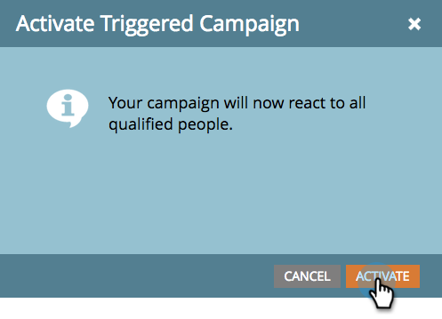

# 激活触发器智能活动 |计划选项卡{#activate-a-trigger-smart-campaign-schedule-tab}

激活触发器智能活动就像将其打开一样。 这是该做什么。

1. 在智能活动的&#x200B;**计划**&#x200B;选项卡中，单击&#x200B;**激活**。

   

   >[!TIP]
   >
   >激活前请查看智能活动。

1. 再次单击&#x200B;**激活**。

   

   >[!CAUTION]
   >
   >单击“激活”之前，确保活动已准备就绪！

从现在开始，任何有资格获得智能列表的人都将经历由您的智能活动定义的流程。