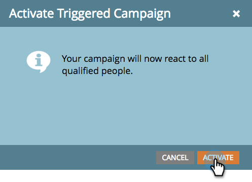

# 激活触发型智能营销活动 | 计划选项卡 {#activate-a-trigger-smart-campaign-schedule-tab}

激活触发器智能促销活动与打开触发器类似。 该怎么做呢。

1. 在Smart Campaign的&#x200B;**[!UICONTROL Schedule]**&#x200B;选项卡中，单击&#x200B;**[!UICONTROL Activate]**。

   

   >[!TIP]
   >
   >在激活之前查看Smart Campaign。

1. 再次单击&#x200B;**[!UICONTROL Activate]**。

   

   >[!TIP]
   >
   >在激活之前，请确保营销活动已准备就绪！

从此时起，任何符合智能列表资格的人都将通过您的Smart Campaign定义的流程。
