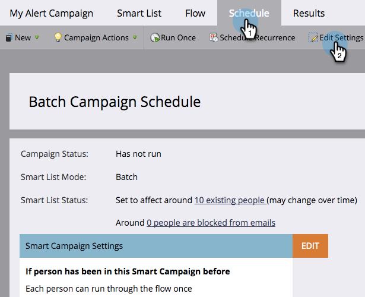
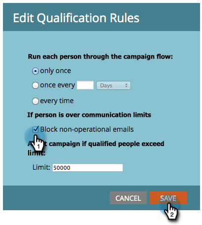

# 将通信限制应用于智能营销活动 {#apply-communication-limits-to-smart-campaign}

>[!PREREQUISITES]
>
>[启用通信限制](/help/marketo/product-docs/administration/email-setup/enable-communication-limits.md){target="_blank"}

每天给某人发多次电子邮件是不好的，或者一周内给某人发太多邮件是不好的，对吗？ 幸运的是，Marketo Engage的沟通能力有限。

>[!NOTE]
>
>当任何人超过设置的通信限制时，Marketo会阻止非操作电子邮件（始终发送操作电子邮件）。

1. 在Smart Campaign中，单击&#x200B;**[!UICONTROL Schedule]**&#x200B;选项卡，然后单击&#x200B;**[!UICONTROL Edit Settings]**。

   

1. 选中&#x200B;**[!UICONTROL Block non-operational emails]**&#x200B;复选框，然后单击&#x200B;**[!UICONTROL Save]**。

   

>[!NOTE]
>
>限制是指Smart Campaign可以影响的合格人员数。

>[!TIP]
>
>若要将此设为默认值，请在“管理员”部分编辑您的[通信限制](/help/marketo/product-docs/administration/email-setup/enable-communication-limits.md){target="_blank"}。

现在，您可以放心，不会意外向受众发送过多电子邮件。
