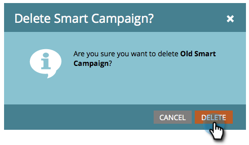

# 营销活动操作：删除智能营销活动 {#campaign-actions-delete-a-smart-campaign}

如果您有一个不再需要的旧智能营销活动，则可以将其删除。 下面是具体操作方法。

>[!CAUTION]
>
>在删除之前请务必确认。 删除智能营销活动后，将无法恢复该活动。

1. 转到 **营销活动** 区域。

   

1. 导航到不活动的智能营销活动。 在 **Campaign** **操作** 下拉列表，选择 **删除**.

   

   >[!TIP]
   >
   >要取消处理活动的智能营销活动而不将其完全删除，请了解如何 [中止智能营销活动](/help/marketo/product-docs/core-marketo-concepts/smart-campaigns/using-smart-campaigns/abort-a-smart-campaign.md).

1. 单击 **删除** 以确认。

   

   >[!CAUTION]
   >
   >Do **NOT** 删除流程步骤中具有人员的活动智能营销活动。 该活动可能仍将执行。
