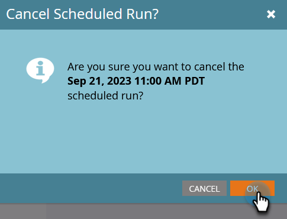

# 取消已计划的批处理营销活动运行 {#cancel-a-scheduled-batch-campaign-run}

如果您计划了某个批次营销活动的运行，并且希望取消该操作，请按照以下步骤操作。

1. 选择营销活动并转到&#x200B;**[!UICONTROL Schedule]**&#x200B;选项卡。

   

1. 找到要取消的计划运行，然后单击其旁边的&#x200B;**x**。

   

1. 单击&#x200B;**[!UICONTROL OK]**&#x200B;确认取消。

   

>[!NOTE]
>
>如果运行已经开始，执行此操作将毫无帮助。 当您决定需要取消未来的运行时，请使用此选项。
